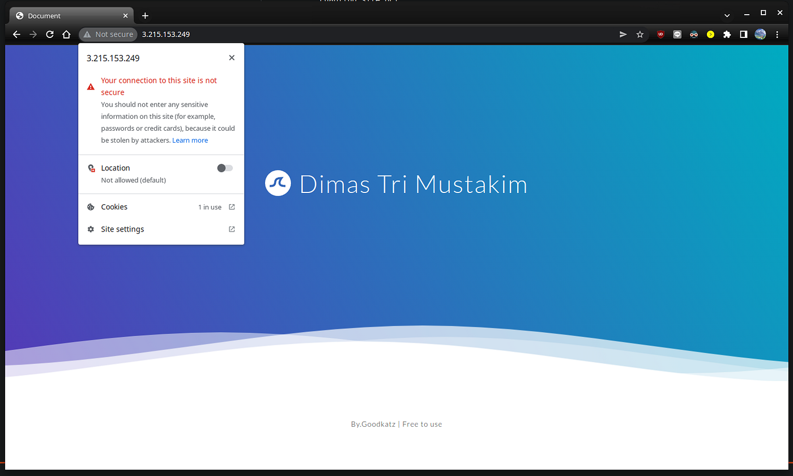
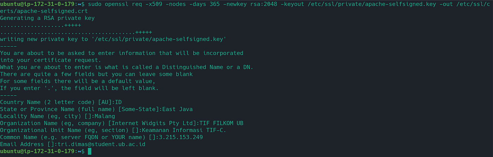
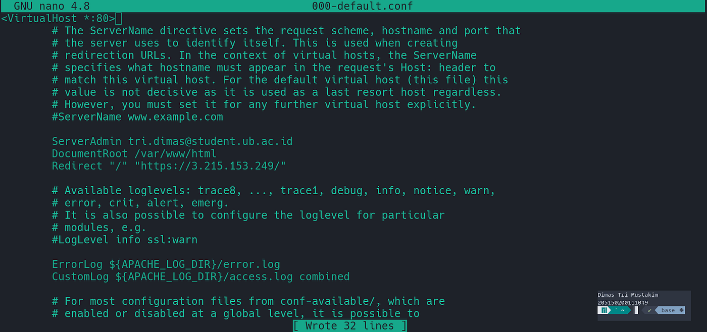
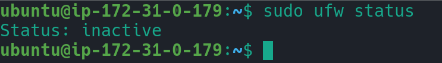
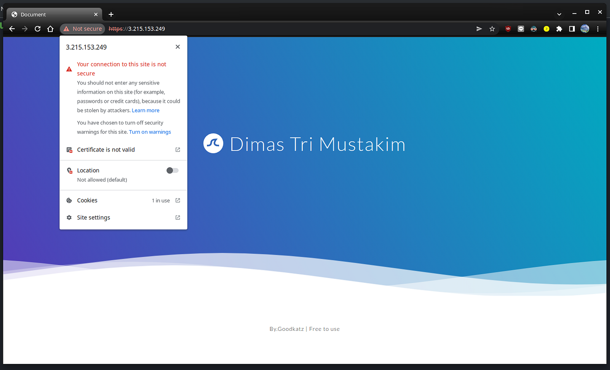
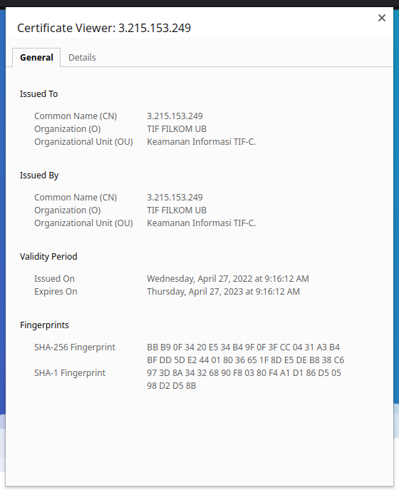

## Konfigurasi dan Pembuatan Self Signed SSL Certificate Pada Website


 on Unsplash](../../assets/ssl-website/0IttxPpNmv4n2kqKk.jpg)

<div align="center">
  Photo by <a href="https://unsplash.com/@markusspiske?utm_source=medium&utm_medium=referral">Markus Spiske</a> on Unsplash
</div>

SSL/TLS merupakan salah satu komponen penting yang harus dimiliki website\. Dengan SSL, transfer data di dalam website menjadi lebih aman dan terenkripsi\. Ketika sistem keamanan ini ditambahkan ke dalam sebuah website, maka URL website akan berubah menjadi HTTPS\. SSL/TLS sendiri diaplikasikan dengan cara menggunakan sebuah sertifikat SSL\. Sertifikat ini mengaplikasikan konsep kriptografi asimetrik dimana terdapat public key dan private key yang digunakan\. SSL/TLS dapat mengamankan data saat berkomunikasi dengan web dan menjamin bahwa website yang diakses adalah yang asli\.

Pada percobaan ini, saya mencoba untuk melakukan pengamanan sebuah situs menggunakan sertifikat SSL yang saya tanda tangani \( _sign_ \) sendiri\. Situs yang menjadi bahan eksperimen saya dihosting menggunakan Ubuntu versi 20\.04 dengan memanfaatkan layanan AWS\. Berikut merupakan screenshot dari situs yang akan diamankan menggunakan SSL/TLS\.




### Proses pembuatan SSL Certificate

Proses pembuatan sertifikat SSL dilakukan dengan menggunakan perintah openssl yang ada di Linux\. OpenSSL sendiri merupakan sebuah peralatan kriptografi yang mengimplementasikan SSL v2/v3 dan TLS v1 dan standar kriptografi lainnya yang dibutuhkan\.

Untuk membuat sertifikat beserata kuncinya digunakan perintah berikut

```bash
sudo openssl req -x509 -nodes -days 365 \
  -newkey rsa:2048 \
  -keyout /etc/ssl/private/apache-selfsigned.key \
  -out /etc/ssl/certs/apache-selfsigned.crt
```

Perintah tersebut akan menghasilkan sertifikat dengan format X\.509 dengan umur 365 hari beserta keynya dengan algoritma RSA dengan panjang 2048 bit\. Key yang dihasilkan akan disimpan di /etc/ssl/private/apache\-selfsigned\.key dan sertifikatnya ada di /etc/ssl/certs/apache\-selfsigned\.crt\.

Pada proses tersebut akan diminta untuk menambahkan informasi lain dan saya masukkan detail seperti berikut\.




Setelah menjalankan perintah tersebut, maka akan dihasilkan file key dan juga sertifikatnya\.

### Konfigurasi SSL/TLS pada server apache

**1\. Membuat file konfigurasi**


Langkah pertama yang dilakukan adalah dengan membuat file konfigurasi berisi parameter yang akan digunakan webserver Apache\. File kongurasi tersebut akan dinamai ssl\-params\.conf dan ditaruh di dalam directory /etc/apache2/conf\-available\. File tersebut kemudian diisi dengan\.

```
SSLCipherSuite EECDH+AESGCM:EDH+AESGCM
# Requires Apache 2.4.36 & OpenSSL 1.1.1
SSLProtocol -all +TLSv1.3 +TLSv1.2
SSLOpenSSLConfCmd Curves X25519:secp521r1:secp384r1:prime256v1
# Older versions
# SSLProtocol All -SSLv2 -SSLv3 -TLSv1 -TLSv1.1
SSLHonorCipherOrder On
# Disable preloading HSTS for now.  You can use the commented out header line that includes
# the "preload" directive if you understand the implications.
# Header always set Strict-Transport-Security "max-age=63072000; includeSubDomains; preload"
Header always set X-Frame-Options DENY
Header always set X-Content-Type-Options nosniff
# Requires Apache >= 2.4
SSLCompression off
SSLUseStapling on
SSLStaplingCache "shmcb:logs/stapling-cache(150000)"
# Requires Apache >= 2.4.11
```

**2\. Memodifikasi SSL Virtual Host File**

Selanjutnya diperlukan untuk memodifikasi Apache SSL Virtual Host File yang ada di /etc/apache2/sites\-available/default\-ssl\.conf\. Parameter yang diubah didalam file konfigurasi tersebut yaitu email serveradmin, servername, letak/path SSLCertificateFile dan SSLCertificateKeyFile\. File konfigurasi tersebut akan menjadi kurang lebih seperti ini\.
```
<IfModule mod_ssl.c>
<VirtualHost _default_:443>
ServerAdmin tri.dimas@student.ub.ac.id
ServerName server_domain_or_IP
DocumentRoot /var/www/html
ErrorLog ${APACHE_LOG_DIR}/error.log
CustomLog ${APACHE_LOG_DIR}/access.log combined
SSLEngine on
SSLCertificateFile      /etc/ssl/certs/apache-selfsigned.crt
SSLCertificateKeyFile /etc/ssl/private/apache-selfsigned.key
<FilesMatch "\.(cgi|shtml|phtml|php)$">
SSLOptions +StdEnvVars
</FilesMatch>
<Directory /usr/lib/cgi-bin>
SSLOptions +StdEnvVars
</Directory>
</VirtualHost>
```

**3\. Memodifikasi HTTP Host File untuk redirect ke HTTPS**

Sampai disini server akan dapat menyediakan halaman web menggunakan HTTP dan HTTPS\. Demi keamanan, sebaiknya dilakukan redirect HTTP ke HTTPS\. Hal itu dilakukan dengan memodifikasi file **/etc/apache2/sites\-available/000\-default\.conf** dengan menambahkan parameter redirect\. Di dalam kasus saya yaitu **Redirect “/” “https://3\.215\.153\.249/"**




Redirect

**4\. Mengatur firewall**

Selanjutnya kita harus memastikan bahwa aplikasi “Apache Full” ada di dalam aplikasi yang diberpolehkan di firewall\. Untuk mengatur firewall di Linux dapat digunakan perintah ufw\. Di AWS Educate yang saya gunakan firewall ufw tidak diaktifkan sehingga bisa saya lewati saja\.





Jika kalian ingin mengaturnya, bisa dilihat di artikel di daftar pustaka\.

**5\. Mengaktifkan perubahan di Apache**

Untuk mengaktifkan perubahan yang telah dibuat, digunakan perintah\-perintah berikut
```
sudo a2enmod ssl
sudo a2enmod headers
sudo a2ensite default-ssl
sudo a2enconf ssl-params
sudo apache2ctl configtest
```

**6\. Testing**

Ketika dibuka, akan ada tampilan bahwa koneksi tidak private dengan kode error NET::ERR\_CERT\_AUTHORITY\_INVALID\. Kemudian ketika dipaksa untuk tampil maka google chrome akan melabeli site tersebut dengan tidak secure\.





Berikut informasi general dari SSL Certificatenya\.





**Penutup**

Jadi begitulah proses untuk melakukan self sign sertifikat ssl pada website\. Di akhir, browser akan menandai website kita dengan tanda merah karena kita tidak dianggap sebagai CA terpercaya\. Percobaan kali ini saya lakukan untuk mengetahui proses pembuatan dan konfigurasi sertifikat SSL sendiri dan bukan untuk penggunaan lebih lanjut\. Jika ingin memasang SSL Certificate pada website, kalian bisa menggunakan layanan gratis dari letsencrypt\. Untuk tatacaranya akan saya tulis di artikel lain\.

<br />

## Daftar Pustaka

**How To Create a Self\-Signed SSL Certificate for Apache in Ubuntu 18\.04 \| DigitalOcean**

How To Create a Self\-Signed SSL Certificate for Apache in Ubuntu 18\.04 \| DigitalOcean\. \(2022\) \. Retrieved 25 April 2022, from [https://www\.digitalocean\.com/community/tutorials/how\-to\-create\-a\-self\-signed\-ssl\-certificate\-for\-apache\-in\-ubuntu\-18\-04](https://www.digitalocean.com/community/tutorials/how-to-create-a-self-signed-ssl-certificate-for-apache-in-ubuntu-18-04)

**How To Set Up Apache Virtual Hosts on Ubuntu 18\.04 \| DigitalOcean**

How To Set Up Apache Virtual Hosts on Ubuntu 18\.04 \| DigitalOcean\. \(2022\) \. Retrieved 27 April 2022, from [https://www\.digitalocean\.com/community/tutorials/how\-to\-set\-up\-apache\-virtual\-hosts\-on\-ubuntu\-18\-04](https://www.digitalocean.com/community/tutorials/how-to-set-up-apache-virtual-hosts-on-ubuntu-18-04)


