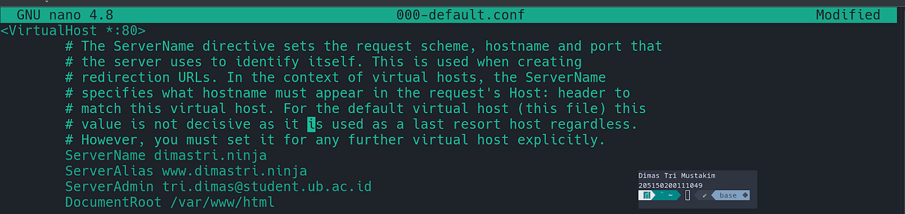
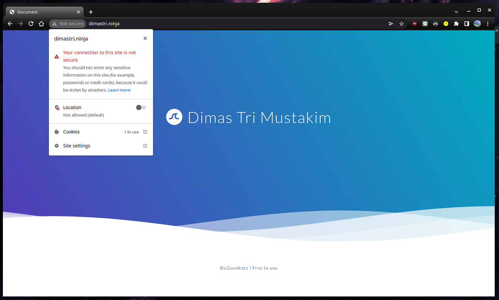
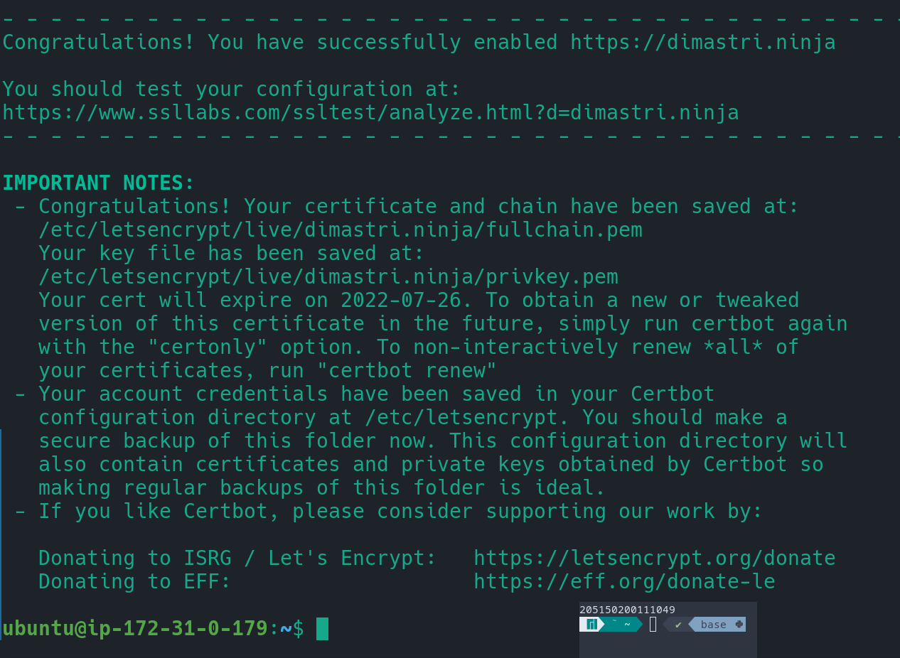
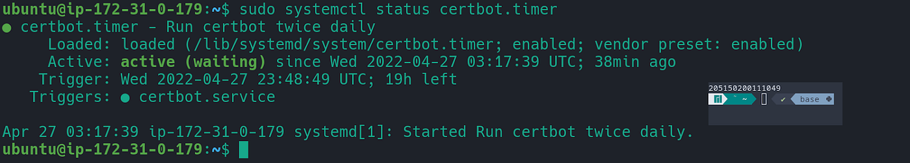
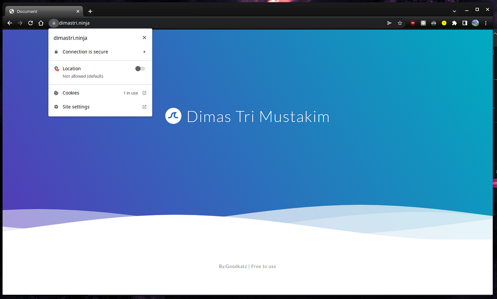
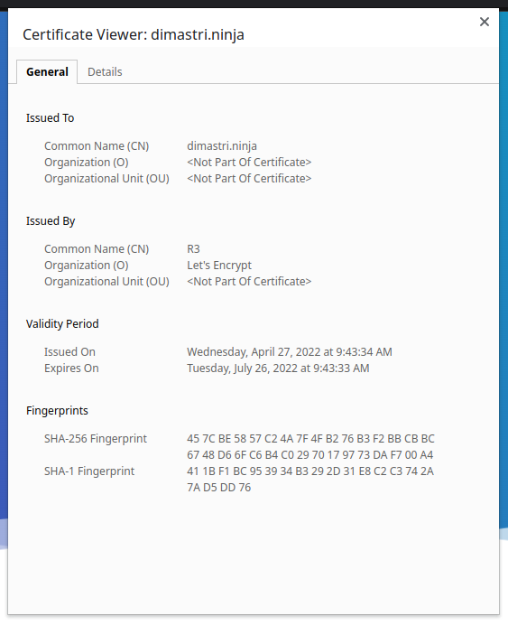
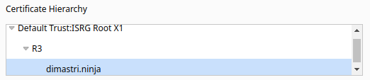

Let's Encrypt merupakan Certificate Authority yang menyediakan sertifikat TLS/SSL secara gratis\. Mereka menyediakan sebuah tool bernama Certbot untuk memudahkan dan mengotomatiskan langkah yang diperlukan untuk mendapatkan sertifikat\.

Letsencrypt hanya mau mengisukan sertifikat ke website yang telah punya nama domain, sehingga saya perlu untuk mendapatkannya\. Saya menggunakan domain yang disediakan name\.com dengan nama domain dimastri\.ninja\. Untuk melakukan praktik ini, saya reset kembali konfigurasi apache2 dan setelah itu saya konfigurasi virtual host dari apache untuk menggunakan nama domain yang saya miliki menjadi seperti screenshot berikut\.



Sehingga website tersebut dapat dibuka menggunakan nama domain seperti ini\.



Kemudian berikut langkah setup SSL/TLS dengan certbot yang saya lakukan\.

### **1\. Install Certbot**

Dapat diinstall menggunakan perintah berikut

```bash
sudo apt install certbot python3-certbot-apache
```

### **2\. Cek konfigurasi Apache Virtual Host**

Disini perlu dicek konfigurasi Virtual Host yang digunakan, tepatnya pada parameter ServerName dan ServerAlias karena akan digunakan oleh Certbot untuk mengetahui domain yang digunakan\. Disini sudah saya periksa dan benar karena juga sudah diatur saat menambahkan domain\.

### **3\. Memperbolehkan HTTPS di Firewall**

Disini kita perlu mengatur firewall untuk memperbolehkan protokol HTTPS\. Disini firewall ufw di EC2 yang digunakan tidak diaktifkan dan pilihan untuk memperbolehkan protokol HTTPS sudah dipilih saat membuat mesin EC2 di AWS\.

```bash
sudo ufw allow 'Apache Full'
```

### **4\. Mendapatkan Sertifikat SSL**

Untuk mendapatkan sertifikat dari LetsEncrypt untuk apache, digunakan perintah berikut\.

```bash
sudo certbot --apache
```

Setelah itu akan diminta untuk memasukkan beberapa informasi dan pilihan yang akan digunakan oleh Certbot dan diakhir ketika sukses akan ditampilkan pesan seperti berikut\.



**5\. Verifying Certbot Auto\-Renewal**



### **6\. Testing**





Detail dari Sertifikat memiliki Hierarki seperti screenshot berikut



## **Daftar Pustaka**

**How To Secure Apache with Let’s Encrypt on Ubuntu 18\.04 \| DigitalOcean**

How To Secure Apache with Let’s Encrypt on Ubuntu 18\.04 \| DigitalOcean\. \(2022\) \. Retrieved 27 April 2022, from [https://www\.digitalocean\.com/community/tutorials/how\-to\-secure\-apache\-with\-let\-s\-encrypt\-on\-ubuntu\-18\-04](https://www.digitalocean.com/community/tutorials/how-to-secure-apache-with-let-s-encrypt-on-ubuntu-18-04)
