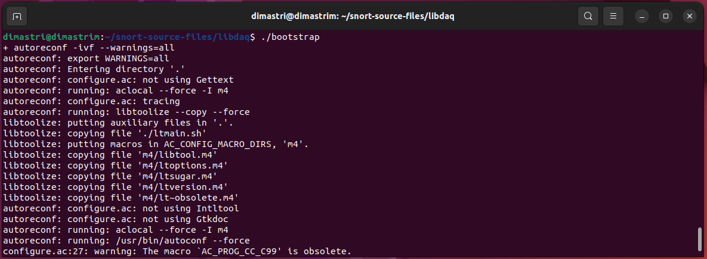

Security audit merupakan evaluasi dan penilaian komprehensif sistem informasi di dalam lingkup organisasi\. Biasanya penilaian tersebut mengukur keamanan sistem informasi terhadap daftar periksa praktik audit terbaik industri, standar eksternal, atau peraturan yang berlaku disekitar\. Security Auditing yang menyeluruh akan menilai kontrol keamanan organisasi yang berkaitan dengan komponen fisk dari lingkungan sistem, aplikasi dan perangkat lunak, celah keamanan jaringan, dan dimensi manusia\. Di dalam security cycle, security audit dilakukan setelah proses monitoring\.

Setelah melakukan auditing kemanan dan mengaplikasikan policies dan standar keamanan yang baru, diperlukan proses monitoring untuk melihat apakah security di dalam organisasi sudah berjalan dengan baik dan juga sebagai bahan untuk melakukan security audit berikutnya\. Monitoring ada banyak, dan salah satunya adalah monitoring lalu lintas di dalam jaringan\.

Salah satu aplikasi yang digunakan untuk melakukan monitoring jaringan adalah Snort\. Dikutip dari website snort, Snort adalah Intrusion Prevention System \(IPS\) Open Source terkemuka di dunia\. Snort IPS menggunakan serangkaian aturan \(rules\) yang membantu menentukan aktivitas jaringan berbahaya dan menggunakan aturan tersebut untuk menemukan paket yang cocok dengannya dan menghasilkan peringatan bagi pengguna\. Snort memiliki tiga kegunaan utama: Sebagai packet sniffer seperti tcpdump, sebagai packet logger — yang berguna untuk debugging lalu lintas jaringan, atau dapat digunakan sebagai sistem pencegahan intrusi jaringan yang lengkap\.

Disini saya akan mempraktikan monitoring jaringan menggunakan Snort dengan melakukan set up virtual machine Ubuntu, melakukan instalasi dan konfigurasi snort, kemudian mengetes konfigurasi snort yang sudah dilakukan\.
### **Virtual Machine yang Digunakan\.**

Disini saya menggunakan Sistem Operasi Ubuntu yang memiliki local ip 192\.168\.100\.57 dan akan diserang oleh sistem operasi dengan ip 192\.168\.100\.56\.
### **Instalasi Snort dan Dependensi**

**1\. Menginstall dependency**

Instalasi dependency snort dilakukan dengan perintah berikut\.

```bash
sudo apt install build-essential \
  libpcap-dev libpcre3-dev libnet1-dev \
  zlib1g-dev luajit hwloc libdnet-dev \
  libdumbnet-dev bison flex liblzma-dev \
  openssl libssl-dev pkg-config \
  libhwloc-dev cmake cpputest libsqlite3-dev \
  uuid-dev libcmocka-dev libnetfilter-queue-dev \
  libmnl-dev autotools-dev libluajit-5.1-dev libunwind-dev
```

Berikut screenshot dari instalasi dependency tersebut\.


Kemudian saya buat directory yang akan menyimpan source dari package yang akan diinstall selanjutnya\.

```bash
mkdir snort-source-files
cd snort-source-files
```

**2\. Instalasi Snort Data Acquisition library \(LibDAQ\) \.**

Package tersebut akan di\- _build_ dan di\- _install_ dari source menggunakan perintah\-perintah berikut\.

```bash
git clone https://github.com/snort3/libdaq.git

cd libdaq

./bootstrap

./configure

make

make install
```

Berikut screenshot proses instalasi LibDAQ\.





**3\. Instalasi Tcmalloc**

Tc malloc digunakan untuk mengoptimasi alokasi memori dan menyediakan penggunaan memori yang lebih daik\. Instalasi package ini juga dilakukan dari source dengan langkah sebagai berikut\.

a\. Mendownload source

```bash
wget https://github.com/gperftools/gperftools/releases/download/gperftools-2.10/gperftools-2.10.tar.gz
```

b\. Mengekstrak file source dan cd ke dalamnya

```bash
tar xzf gperftools-2.10.tar.gz && cd gperftools-2.10/
```

c\. Menjalankan file configure

```bash
./configure

d\. Build dan install

```bash
sudo make && sudo make install
```

Berikut screenshot proses instalasi package tersebut\.


**4\. Instalasi Snort 3**

Setelah semua dependencynya telah diinstall, saya lakukan instalasi snort dengan langah seperti berikut\.

**a\. Menyalin source code dari snort 3 dari github repository dan cd ke dalamnya dengan perintah**

```bash
git clone https://github.com/snort3/snort3.git
```


**b\. Mengkonfigurasi dan mengaktifkan tcmalloc**

`./configure_cmake.sh — prefix=/usr/local — enable-tcmalloc`


**c\. Masuk ke direktori build, compile, dan install\.**

`cd build && sudo make && sudo make install`


**d\. Mengupdate shared libraries**

`sudo ldconfig`


**e\. Membuat symblolic link untuk /usr/sbin/snort**

`sudo ln -s /usr/local/bin/snort /usr/sbin/snort`


**f\. Memverifikasi instalasi snort\.**

`snort -V`


### **Konfigurasi Network Interface**

**1\. Mengetahui interface mana yang akan digunakan**

Bisa dilakukan dengan menggunakan perintah `ip a` \. Disini interface yang akan saya gunakan bernama ens33\.


**2\. Mengaktifkan mode promiscuous**

Digunakan agar snort dapat melihat semua lalu lintas jaringan yang dikirim ke interface tersebut\. Untuk mengaktifkannya menggunakan perintah

`ip link set dev ens33 promisc on`

Kemudian dapat diiverifikasi menggunakan perintah

```bash
ip add sh eth0
```


Dapat dilihat terdapat kata PROMISC yang semula tidak ada\.

**2\. Menonaktifkan interface offloading**

```bash
ethtool -K ens33 gro off lro off
```
Digunakan untuk mencegah snort 3 memotong paket besar\. Pertama saya cek apakah fitur ini diaktifkan dengan menggunakan perintah\.

```bash
ethtool -k ens33 | grep receive-offload
```

Output perintah tersebut di saya adalah sebagai berikut\.


Diketahui bahwa gro on dan lro fixed, kita dapat menonaktifkannya dengan perintah berikut\.

```bash
ethtool -K ens33 gro off lro off
```


Dapat dilihat bahwa sekarang keduanya sudah off\.

**3\. Membuat dan mengaktifkan systemd service unit untuk implementasi konfigurasi sebelumnya\.**

Pertama saya buat file /etc/systemd/system/snort3\-nic\.service dan diisi dengan konfigurasi serperti berikut\.


Kemudian memuat ulang konfigurasi systemd menggunakan perintah

`sudo systemctl daemon-reload`

Mengaktifkan service saat booting

`sudo systemctl enable — now snort3-nic.service`

Kemudian terakhir kita bisa memverifikasi apakah service tersebut telah berjalan dengan baik menggunakan perintah berikut

`sudo systemctl status snort3-nic.service`


### **Menginstall Community Rulesets**

Di dalam snort, rulesets merupakan keuntungan utama dari mesin pendeteksi intruksi\. Terdapat beberapa tipe dari snort rules yaitu contohnya adalah community rulesets, registered ruleset, dan subscriber ruleset\. Community rulesets dikembangkan oleh komunitas snort dan dicek kualitasnya oleh Cisco Talos\. Community ruleset tersedia secara gratis untuk semua user\. Disini saya akan menggunakan community ruleset ini\. Berikut langkah yang saya lakukan untuk menginstall community rulesets\.

**1\. Mendownload snort 3 community rules**

Rules tersebut saya download dari website snort dan disimpan di dalam folder tersendiri\. Untuk mendownloadnya saya manfaatkan wget\.

`wget https://www.snort.org/downloads/community/snort3-community-rules.tar.gz`


File yang terdownload berbentuk tar\.gz sehingga perlu untuk di extract ke dalam folder rules dengan perintah berikut\.

`tar xzf community-rules.tar.gz -C /usr/local/etc/rules/`

Berikut isi dari file community rules tersebut\.


File snort3\-community\.rules adalah file yang berisi koleksi rules yang akan digunakan\.

**2\. Melakukan konfigurasi pada snort\.lua**

File snort\.lua berisi konfigurasi utama Snort yang memungkinkan implementasi dan konfigurasi preprocessor dari snort, penyertaan file rule, event filter, output, dan sebagainya\. File tersebut terletak di folder /usr/local/etc/snort\. Disini saya atur variable HOME\_NET untuk mencakup jaringan yang ada di rumah saya yaitu 192\.168\.100\.0/24\.


**3\. Memasukkan file community rules kedalam konfigurasi snort**

File snort3\-community\.rules yang telah didownload sebelumnya dilakukan include di bagian ips di dalam file snort\.lua seperti pada screenshot berikut\.


**4\. Mengecek file konfigurasi snort yang telah dibuat\.**

Pertama dicek apakah konfigurasi sudah benar dengan perintah berikut\.

`sudo snort -T -i ens33 -c /usr/local/etc/snort/snort.lua`

Parameter \-T akan melakukan pengecekan terhadapa konfigurasi yang dibuat dan akan mengeluarkan output yang panjang seperti berikut\.


5\. Menjalankan Snort

Untuk menjalankan snort saya menggunakan perintah berikut

`sudo snort -l ./log -L pcap -A fast -q -c /usr/local/etc/snort/snort.lua -i ens33`

Parameter \-l digunakan agar log file disimpan di folder \./log dan \-L menyatakan untuk log file dalam format pcap dan \-A \(alert\) dalam mode fast \(karena console tidak bisa di saya\) \. Kemudian \-q menyatakan quiet mode agar proses startup snort tidak ditampilkan, \-c untuk menyatakan file konfigurasi yang akan digunakan, dan terakhir \-i untuk menspesifikan interface yang akan dimonitor\.

Disini saya ada permasalahan bahwa file log tidak tersimpan, saya sudah mencoba menggunakan opsi \-l dengan folder lain, opsi \-L dengan mode dump dan pcap, dan sebagainya tetapi belum bisa\.
### **Testing IDS terhadap beberapa serangan**

Disini saya melakukan testing snort dengan Nmap dan serangan Dos sederhana\.

**1\. Nmap**

Disini saya melakukan TCP SYN scan menggunakan nmap seperti berikut\.


Dari hasil scanning tersebut menunjukkan bahwa terdapat port 80/tcp \(http\) yang terbuka karena saya telah menginstall apache2 di sistem operasi tersebut\.

Untuk keluaran alert dari snort adalah sebagai berikut\.


Dapat dilihat terdapat dua alert dengan pesan “PROTOCOL\-SNMP” request tcp yang terklasifikasi sebagai “Attempted Information Leak” dengan prioritas 2 serta ip source dan destination dari paket tersebut\.

**2\. Slowloris**

Untuk DOS, saya menggunakan package slowhttptest di Kali Linux dengan perintah seperti berikut\.

`slowhttptest -c 1000 -H -g -o slowhttp -i 10 -r 200 -t GET -u http://192.168.100.57 -x 24 -p 3`

Parameter \-c digunakan untuk menggunakan 1000 connections, \-H untuk mode slowloris, \-g dan \-o untuk membuat file output, \-i untuk waktu tunggu data, \-r untuk banyak request, \-t untuk tipe request, \-x untuk maximum length, dan \-p untuk waktu timeout\. Keluaran perintah tersebut yaitu seperti berikut\.


Screenshot dari keluaran snort adalah sebagai berikut


Terdapat banyak sekali alert yang muncul\. Alert tersebut berisi pesan “OS\-LINUX Linux Kernel Challenge ACK provocation attempt” dengan klasifikasi “Attempted Administrator Privilege Gain” dengn prioritas 1\. Pada saat DOS tersebut terjadi saya juga cek apakah web bisa dibuka dan ternyata tidak\. Hal ini juga menunjukkan Snort dalam mode IDS tidak mencegah serangan\.
### **Daftar Pustaka**

**Basic snort rules syntax and usage \[updated 2021\] — Infosec Resources\.** Basic snort rules syntax and usage \[updated 2021\] — Infosec Resources\. \(2021\) \. Retrieved 6 June 2022, from [https://resources\.infosecinstitute\.com/topic/snort\-rules\-workshop\-part\-one/](https://resources.infosecinstitute.com/topic/snort-rules-workshop-part-one/)

**How to Install Snort on Ubuntu 20\.04\.** How to Install Snort on Ubuntu 20\.04\. \(2021\) \. Retrieved 6 June 2022, from [https://linoxide\.com/install\-snort\-on\-ubuntu/](https://linoxide.com/install-snort-on-ubuntu/)

**How to Use Nmap: Commands and Tutorial Guide\.** How to Use Nmap: Commands and Tutorial Guide\. \(2022\) \. Retrieved 6 June 2022, from [https://www\.varonis\.com/blog/nmap\-commands](https://www.varonis.com/blog/nmap-commands)

**Slowhttptest Usage Example\.** Tools, s\. \(2022\) \. slowhttptest \| Kali Linux Tools\. Retrieved 6 June 2022, from [https://www\.kali\.org/tools/slowhttptest/](https://www.kali.org/tools/slowhttptest/)


